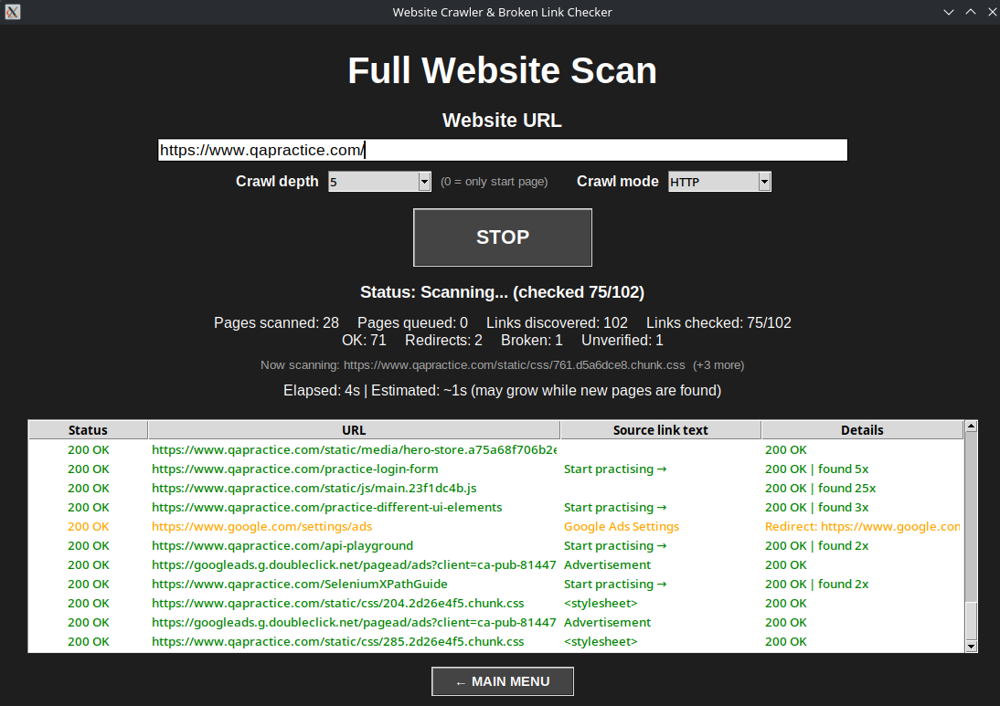

# Website Crawler & Broken Link Checker

Python-based QA tool for website crawling and link checking.

## What does it do?

- Crawls websites and discovers URLs
- Checks HTTP status codes of found links
- Detects working links, broken links, redirects, redirect chains and unverified responses
- Shows response time for each link
- Supports single link check
- Supports configurable crawl depth
- Supports JavaScript-enabled pages via Playwright
- Generates reports and exports results to Excel

## Technologies

- Python
- Tkinter
- Requests
- BeautifulSoup
- Playwright
- openpyxl
- unittest

## How to use

```bash
python3 main.py
```

Main options:

- **Full Website Scan** – crawl a website and check all discovered links
- **Single Link Check** – check the status of one URL
- **Settings** – adjust application settings
- **More** – additional options and tools

For a Full Website Scan, enter the URL, choose the crawl depth and crawl mode, then start the scan.

## Screenshot



## Example Reports

The `example_reports/` folder contains sample reports generated while testing the application on publicly available websites intended for QA, automation and web testing.
